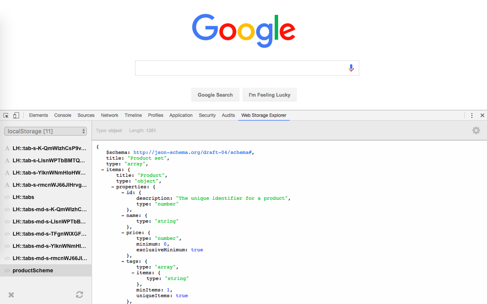
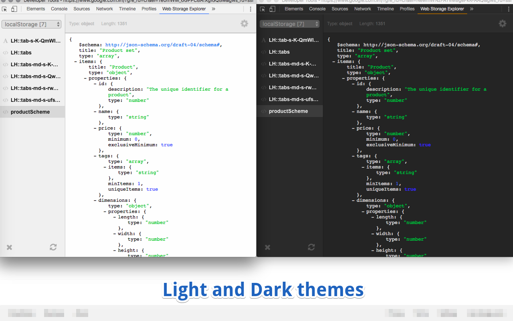
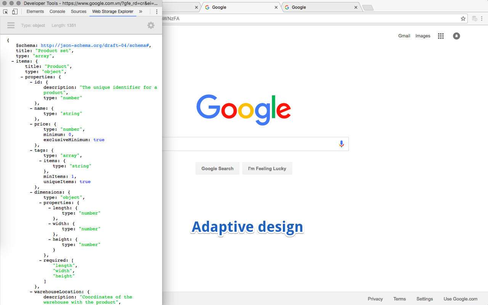

## Web Storage Explorer
**Google Chrome extension for Web Developers**

Web Storage Explorer brings you better ability to explore localStorage and sessionStorage values.
It integrates with DevTools panel and can parse and beautify JSON values.

[**&raquo; Install from Chrome Web Store**](https://chrome.google.com/webstore/detail/web-storage-explorer/hglfomidogadbhelcfomenpieffpfaeb)

### Features
 * JSON parser & beautifier
 * Shows value type and length
 * Delete keys and clear storage in one click
 * Light and Dark themes
 * Adaptive design

### Screenshots
<kbd>
	
</kbd>
<kbd>
	
</kbd>
<kbd>
	
</kbd>

### Contribute
To build extension just run:
 1. `npm install`
 2. `gulp`

It will create two folders: 
 * `build/` &ndash; contains built files
 * `dist/` &ndash; contains compressed zip-file with files from `built`

#### Todo list

* parse JWT tokens
* make i18n
* comments
* adjustable width of key list
* keyboard navigation in key list
* open by browser action?
* choose better icons
* parse timestamps
* other json-view libraries?
